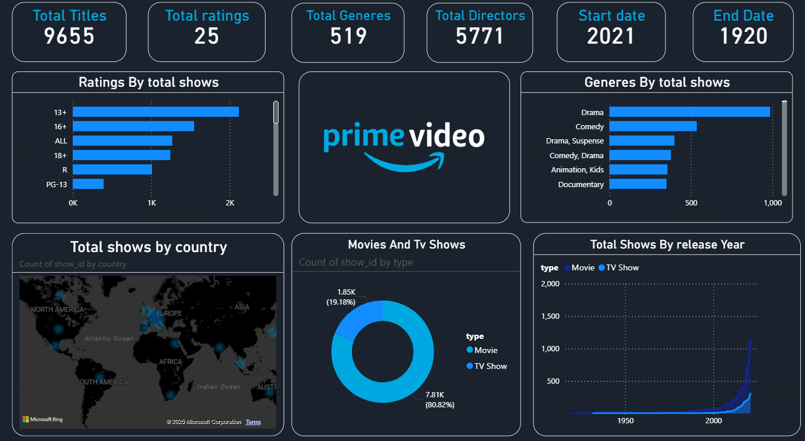

# Amazon-Prime-Dashboard

## 📝 Overview

This project analyzes **Amazon Prime Video content** to uncover insights about movies and TV shows available on the platform. Using **Power BI**, I created an interactive dashboard that visualizes data trends such as content distribution, genres, release years, ratings, and regional insights. The goal is to help understand streaming patterns, audience preferences, and content strategies.

## ✨ Key Features

* 🎞️ **Content Overview** – Explore total titles, movies vs TV shows, and regional spread.
* 📊 **Genre Insights** – Analyze popular genres and their frequency.
* 🗓️ **Release Trends** – Visualize how Amazon Prime’s content library has evolved over the years.
* 🌍 **Country & Rating Analysis** – Understand which countries contribute the most content and how titles are rated.
* 🔍 **Interactive Dashboard** – Dynamic filters and slicers to drill down into specific categories and trends.

## ✅ Dataset Information

* **amazon_prime_titles.csv** used as the main dataset.
* Includes information about titles, type (movie/show), release year, rating, country, and listed genres.
* Data was cleaned and processed to handle missing values, duplicates, and formatting inconsistencies.
* Enables comprehensive exploration of Amazon Prime’s content catalog.

## 🛠️ Tools Used

* **Power BI** – Designed and developed the dashboard for interactive visualizations.
* **Excel** – Used for initial data cleaning and validation.

## 🚀 How to Use

1. Open `amazon prime dashboard.pbix` in **Power BI Desktop**.
2. Interact with slicers and filters to explore titles by genre, rating, year, and country.
3. Use the visuals to analyze content patterns and streaming trends.

## 🗂️ File Structure

* `amazon_prime_titles.csv`: Dataset containing Amazon Prime titles information.
* `amazon prime dashboard.pbix`: Power BI visualization file.
* `README.md`: Documentation file.

## 📊 Power BI Dashboard

## 🤝 How to Contribute

If you’d like to suggest improvements:

* 🍴 Fork this repository.
* 🛠️ Create a feature branch.
* 📬 Submit a pull request with your changes.

---

👉 This project highlights **data analysis and visualization skills** using Power BI, focusing on streaming content trends and platform insights. It’s valuable for understanding **content strategy, audience preferences, and entertainment analytics**.

